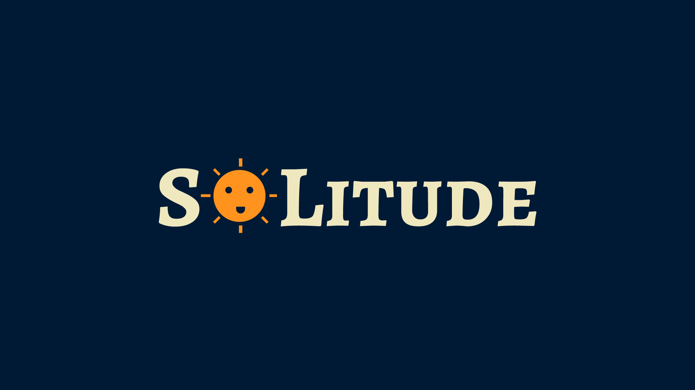

# SOLitude
*Application made during Nasa SpaceApps Challenge 2017 for calculating power usage.*


## Introduction
Solitude represents the loneliness that an exploration team experiences when they perform great research for mankind. This app allows a team to determine their power performance over the course of the mission, with a simple, beautiful interface. The app does a few steps to do so. First, the user selects their location. Currently, the app only has data for the HI-SEAS team, but more data can be added in the future. Next, the team selects which devices they plan to use for the day. A helpful battery display on the right side allows the user to view how much energy they have remaining to use. The amount of solar energy for the day is calculated based on the user's location. 
We worked on creating an app that would allow the team to evaluate their power performance over the course of their mission. Specifically, the app will poll a user's location data to find out the current insolation at that location. Then the user will be asked to deliver the different appliances that they plan on using for their mission. Combining this data, the app will give a visualization of what the user can and cannot use during the mission.

This app was built using ReactJS and Redux. Users can add their own devices to the system with advised wattages, which may then be accessed by other users across the globe. We also plan on adding the ability to see the total weight and cost of the system that is being brought with the crew. While this is not immediately useful for the NASA team, it would be useful as a guide for other teams attempting to develop missions to study similar environments.

## Install

#### Requirements

* NodeJS
* NPM
* Git

#### To Install
```bash
git clone https://github.com/illuminos/SOLitude.git

npm install

npm start
```
